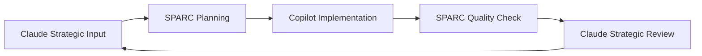

# The-Agentic-Engineering-Trifecta-Manual - Written by Claude
Complete guide to orchestrating Claude, Roo Code SPARC, and GitHub Copilot Agent for maximum development productivity. Learn workflows, templates, and best practices for AI-powered software engineering.

*Mastering Claude, Roo Code SPARC, and GitHub Copilot Agent in Perfect Harmony*

## Table of Contents
1. [Introduction](#introduction)
2. [The Trifecta Overview](#the-trifecta-overview)
3. [Setup & Configuration](#setup--configuration)
4. [Workflow Strategies](#workflow-strategies)
5. [Practical Examples](#practical-examples)
6. [Advanced Techniques](#advanced-techniques)
7. [Troubleshooting](#troubleshooting)
8. [Best Practices](#best-practices)

---

## Introduction

Welcome to the future of software development. The **Agentic Engineering Trifecta** combines three powerhouse AI tools to create an unstoppable development workflow that handles everything from high-level architecture to autonomous implementation.

### Why the Trifecta?

**Traditional Development**: Human → Code → Debug → Deploy

**Agentic Engineering**: Human Intent → AI Orchestra → Production-Ready Software

Each tool in the trifecta has unique superpowers:
- **Claude**: The Architect & Strategist
- **Roo Code SPARC**: The Methodology Master
- **GitHub Copilot Agent**: The Autonomous Implementer

---

## The Trifecta Overview

### 🧠 Claude: The Strategic Mind
**Role**: Chief Technology Officer & Senior Architect
**Strengths**:
- Complex system design and architecture
- Deep analysis and reasoning
- Code review and optimization
- Technical decision making
- Documentation and planning

**Best For**:
- Project inception and planning
- Architectural decisions
- Complex problem solving
- Code quality assessment
- Strategic technical direction

### ⚡ Roo Code SPARC: The Methodology Engine
**Role**: Project Manager & Process Orchestrator
**Strengths**:
- Structured SPARC methodology (Specification, Pseudocode, Architecture, Refinement, Completion)
- Specialized mode delegation
- Boomerang task workflow
- Security-first development
- Modular, maintainable code generation

**Best For**:
- Large, complex projects
- Team coordination
- Quality assurance
- Structured development processes
- Maintaining coding standards

### 🤖 GitHub Copilot Agent: The Autonomous Implementer
**Role**: Senior Developer & DevOps Engineer
**Strengths**:
- Autonomous coding and iteration
- Multi-file editing
- Self-correcting compilation
- GitHub integration
- Continuous deployment

**Best For**:
- Rapid prototyping
- Feature implementation
- Bug fixes and refactoring
- Testing and deployment
- Background task execution

---

## Setup & Configuration

### Prerequisites
- VS Code with Roo Code extension
- GitHub Copilot subscription
- Claude access (Pro recommended)
- OpenRouter account (for additional model variety)

### Initial Configuration

#### 1. Roo Code SPARC Setup
```bash
# Create new project with SPARC methodology
mkdir my-trifecta-project
cd my-trifecta-project
npx create-sparc init

# Open in VS Code
code .
```

#### 2. GitHub Copilot Agent Setup
```bash
# In VS Code Command Palette (Ctrl+Shift+P)
# Look for "Copilot: Enable Agent Mode"
# Or in Copilot Edits panel, switch to "Agent" mode
```

#### 3. Claude Integration
- Keep Claude open in browser/app for strategic consultation
- Use for high-level analysis and architectural decisions
- Copy/paste code between tools as needed

#### 4. OpenRouter Integration
```bash
# Add to your .env file
OPENROUTER_API_KEY=your_openrouter_key
```

### Tool Synchronization Strategy
Create a **project manifest** that all three tools can reference:

```markdown
# PROJECT_MANIFEST.md
## Project: [Your Project Name]
## Current Phase: [Specification/Architecture/Implementation/Testing/Deployment]
## Last Updated: [Date]

### Architecture Decisions (Claude)
- [Key architectural choices]
- [Technology stack decisions]
- [Integration patterns]

### SPARC Progress (Roo Code)
- [ ] Specification Complete
- [ ] Pseudocode Approved
- [ ] Architecture Finalized
- [ ] Implementation In Progress
- [ ] Testing Complete

### Implementation Status (Copilot Agent)
- [Files modified]
- [Features completed]
- [Tests passing]
- [Deployment status]
```

---

## Workflow Strategies

### Strategy 1: Sequential Handoff (Recommended for Complex Projects)

#### Phase 1: Strategic Planning with Claude
```
Prompt: "I want to build [project description]. Please provide:
1. High-level architecture recommendations
2. Technology stack analysis
3. Security considerations
4. Scalability planning
5. Implementation roadmap"
```

**Deliverables**: Architecture docs, tech stack decisions, security requirements

#### Phase 2: SPARC Orchestration with Roo Code
```
# In SPARC Orchestrator mode:
"Using the architecture from Claude [paste architecture], please break this project down using SPARC methodology and delegate tasks to specialized modes."
```

**Deliverables**: Structured project breakdown, specialized task delegation

#### Phase 3: Autonomous Implementation with Copilot Agent
```
# In GitHub Copilot Agent mode:
"Implement the specifications from SPARC following the architecture from Claude. Focus on [specific feature/module]."
```

**Deliverables**: Working code, tests, documentation

### Strategy 2: Parallel Consultation (Best for Medium Projects)

#### Simultaneous Development
1. **Claude**: Provide ongoing architectural guidance
2. **Roo Code SPARC**: Maintain project structure and quality
3. **Copilot Agent**: Handle implementation details

#### Example Workflow:
```
1. Start SPARC Orchestrator with initial requirements
2. Consult Claude for complex decisions as they arise
3. Use Copilot Agent for rapid implementation cycles
4. Return to SPARC for integration and quality assurance
```

### Strategy 3: Iterative Enhancement (Perfect for Existing Projects)

#### Enhancement Cycle:
1. **Claude**: Analyze current codebase and suggest improvements
2. **Roo Code SPARC**: Plan implementation of improvements
3. **Copilot Agent**: Execute the improvements
4. **Repeat**: Continuous improvement loop

---

## Practical Examples

### Example 1: Building a Full-Stack E-commerce Platform

#### Step 1: Claude Strategic Analysis
```
"I want to build a modern e-commerce platform with these requirements:
- User authentication and profiles
- Product catalog with search
- Shopping cart and checkout
- Payment processing
- Admin dashboard
- Mobile responsive

Please provide architectural recommendations, tech stack, and security considerations."
```

**Claude Output**: 
- Recommends microservices architecture
- Suggests React/Next.js frontend, Node.js/Express backend
- Recommends PostgreSQL with Redis caching
- Security: JWT tokens, input validation, HTTPS
- Payment: Stripe integration

#### Step 2: SPARC Methodology Planning
```
# In Roo Code SPARC Orchestrator:
"Using this architecture from Claude [paste], break down the e-commerce platform using SPARC methodology. Create specialized tasks for each component."
```

**SPARC Output**:
- Specification Writer: Detailed user stories and API specs
- Architect: Database schema and API design
- Auto-Coder: Implementation tasks by module
- TDD: Test specifications
- Security Reviewer: Security implementation checklist

#### Step 3: Autonomous Implementation
```
# In GitHub Copilot Agent:
"Implement the user authentication module according to SPARC specifications. Include JWT token management, password hashing, and input validation."
```

**Copilot Output**: Complete auth module with tests

### Example 2: API Enhancement Project

#### Quick Enhancement Workflow:
```
1. Claude: "Analyze this existing API [paste code] and suggest performance improvements"
2. SPARC: "Plan implementation of Claude's suggestions using SPARC methodology"
3. Copilot: "Implement the performance improvements with backward compatibility"
```

### Example 3: Bug Fix Workflow

#### Trifecta Bug Resolution:
```
1. Claude: "This code has a bug [paste error]. What's the root cause and best fix approach?"
2. SPARC Debugger: "Fix the bug following Claude's analysis while maintaining code quality"
3. Copilot: "Implement the fix and add regression tests"
```

---

## Advanced Techniques

### Technique 1: The "Wisdom Council"
For critical decisions, consult all three simultaneously:

```
1. Present problem to Claude for strategic analysis
2. Ask SPARC Orchestrator for structured approach
3. Get Copilot Agent's implementation perspective
4. Synthesize the three viewpoints into final decision
```

### Technique 2: Model Rotation with OpenRouter
Leverage different models for different tasks:

```javascript
// Example: Rotate models based on task type
const modelSelection = {
  architecture: "anthropic/claude-3.5-sonnet",
  implementation: "openai/gpt-4-turbo",
  documentation: "google/gemini-pro",
  testing: "meta-llama/llama-3.1-70b"
};
```

### Technique 3: The "Code Review Triangle"
```
1. Copilot Agent: Implements feature
2. SPARC Security Reviewer: Audits for security and quality
3. Claude: Provides strategic code review and optimization suggestions
```

### Technique 4: Continuous Integration Loop
```
1. Copilot Agent: Commits code to branch
2. SPARC Integration: Reviews and merges changes
3. Claude: Monitors overall project health and suggests architectural improvements
```

---

## Troubleshooting

### Common Issues and Solutions

#### Issue: Tools Giving Conflicting Advice
**Solution**: Use Claude as the "tie-breaker" for architectural decisions, SPARC for process decisions, and Copilot for implementation details.

#### Issue: Context Loss Between Tools
**Solution**: Maintain a shared PROJECT_MANIFEST.md that gets updated after each major decision or implementation.

#### Issue: Over-Engineering
**Solution**: Set clear scope boundaries and use SPARC's modular approach to prevent feature creep.

#### Issue: Integration Complexity
**Solution**: Start simple with Strategy 1 (Sequential Handoff) before attempting parallel workflows.

### Debug Commands

#### Check SPARC Status:
```bash
# In Roo Code, check current project status
cat .roo/PROJECT_STATUS.md
```

#### Verify Copilot Agent Status:
```bash
# Check GitHub Actions for agent activity
gh run list --repo your-repo
```

#### Claude Context Management:
```
"Summarize our current project status and next steps based on our conversation history."
```

---

## Best Practices

### The Golden Rules

#### 1. **Single Source of Truth**
- Maintain one primary source for architectural decisions (usually Claude's output)
- Update PROJECT_MANIFEST.md after every major decision
- Use version control for all tool outputs

#### 2. **Clear Role Boundaries**
- **Claude**: Strategy and architecture
- **SPARC**: Process and methodology
- **Copilot**: Implementation and deployment

#### 3. **Iterative Validation**
```
Every major milestone:
1. Claude validates strategic alignment
2. SPARC validates process adherence
3. Copilot validates implementation quality
```

#### 4. **Context Preservation**
- Save important outputs from each tool
- Reference previous decisions in new prompts
- Maintain conversation continuity

#### 5. **Quality Gates**
```
Before proceeding to next phase:
✅ Claude approves architecture
✅ SPARC completes current phase
✅ Copilot passes all tests
```

### Performance Optimization

#### Tool Selection Matrix:
| Task Type | Primary Tool | Secondary | Tertiary |
|-----------|-------------|-----------|----------|
| Architecture Design | Claude | SPARC Architect | - |
| Implementation | Copilot Agent | SPARC Auto-Coder | - |
| Testing | SPARC TDD | Copilot Agent | Claude |
| Documentation | SPARC Docs Writer | Claude | Copilot |
| Debugging | SPARC Debugger | Copilot Agent | Claude |
| Security Review | SPARC Security | Claude | Copilot |
| Deployment | Copilot Agent | SPARC DevOps | Claude |

### Cost Management

#### Model Selection Strategy:
```
High-complexity tasks: Claude 3.5 Sonnet (premium)
Medium tasks: GPT-4 Turbo (balanced)
Simple tasks: OpenRouter free models
Bulk operations: Fastest available model
```

#### Request Optimization:
- Batch similar requests to same tool
- Use model switching in OpenRouter for cost efficiency
- Cache common architectural decisions

---

## Workflow Templates

### Template 1: New Feature Development

```markdown
## New Feature: [Feature Name]

### Phase 1: Strategic Planning (Claude)
- [ ] Analyze requirements and constraints
- [ ] Recommend architecture approach
- [ ] Identify integration points
- [ ] Security considerations

### Phase 2: SPARC Orchestration
- [ ] Specification: Define user stories and acceptance criteria
- [ ] Pseudocode: Break down implementation logic
- [ ] Architecture: Design component interfaces
- [ ] Refinement: Plan testing and optimization
- [ ] Completion: Integration and deployment strategy

### Phase 3: Implementation (Copilot Agent)
- [ ] Create feature branch
- [ ] Implement core functionality
- [ ] Write tests
- [ ] Integration testing
- [ ] Documentation
- [ ] Deploy to staging

### Phase 4: Validation Loop
- [ ] Claude: Strategic review
- [ ] SPARC: Quality assurance
- [ ] Copilot: Performance testing
```

### Template 2: Bug Fix Workflow

```markdown
## Bug Fix: [Bug Description]

### Immediate Actions
1. **Claude Analysis**: Root cause and impact assessment
2. **SPARC Debugger**: Systematic debugging approach
3. **Copilot Agent**: Implement fix with tests

### Validation Steps
1. **Regression Testing**: Ensure no new issues
2. **Performance Impact**: Check system performance
3. **Documentation Update**: Update relevant docs
```

### Template 3: Code Review Process

```markdown
## Code Review: [PR/Commit Reference]

### Review Stages
1. **Copilot Agent**: Automated code analysis and suggestions
2. **SPARC Security**: Security vulnerability scan
3. **Claude**: Architectural alignment and optimization review

### Checklist
- [ ] Code quality standards met
- [ ] Security best practices followed
- [ ] Architecture guidelines respected
- [ ] Tests cover edge cases
- [ ] Documentation updated
```

---

## Advanced Integration Patterns

### Pattern 1: The Feedback Loop



### Pattern 2: The Specialization Matrix

```
Decision Type    | Primary  | Validator | Implementer
Architecture     | Claude   | SPARC     | Copilot
Process          | SPARC    | Claude    | Copilot
Implementation   | Copilot  | SPARC     | Claude
Security         | SPARC    | Claude    | Copilot
Performance      | Claude   | Copilot   | SPARC
```

### Pattern 3: The Escalation Chain

```
Simple Issues: Copilot Agent → Auto-resolve
Medium Issues: SPARC Mode → Structured resolution
Complex Issues: Claude → Strategic analysis → SPARC → Copilot
```

---

## Future-Proofing Your Workflow

### Emerging Patterns
- **Model Specialization**: Assign specific models to specific types of tasks
- **Autonomous Handoffs**: Tools automatically passing context to each other
- **Continuous Learning**: Each tool learns from the others' outputs

### Scalability Considerations
- Team coordination with multiple developers using the trifecta
- Enterprise-grade security and compliance
- Integration with existing development tools and processes

### Next-Generation Features
- Real-time collaboration between tools
- Automated workflow optimization
- Predictive issue resolution

---

## Conclusion

The Agentic Engineering Trifecta represents a paradigm shift in software development. By leveraging the unique strengths of Claude, Roo Code SPARC, and GitHub Copilot Agent, developers can achieve unprecedented productivity while maintaining code quality and architectural integrity.

### Key Takeaways:
1. **Each tool has a specialized role** - don't try to make one tool do everything
2. **Context preservation is crucial** - maintain shared understanding across tools
3. **Iterative validation** ensures quality at every step
4. **Start simple** and gradually adopt more advanced patterns

### The Future is Agentic
As these tools continue to evolve and integrate more deeply, the line between human developer and AI assistant will blur. The developers who master this trifecta today will be the architects of tomorrow's software landscape.

Remember: You're not just using tools; you're conducting an orchestra of intelligence. Each tool brings its unique voice to create a symphony of code that's greater than the sum of its parts.

**Happy Agentic Engineering!** 🚀

---

*Last Updated: June 2025*
*Version: 1.0*
*Created by: The Agentic Engineering Community*
